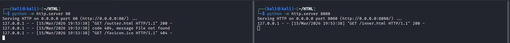
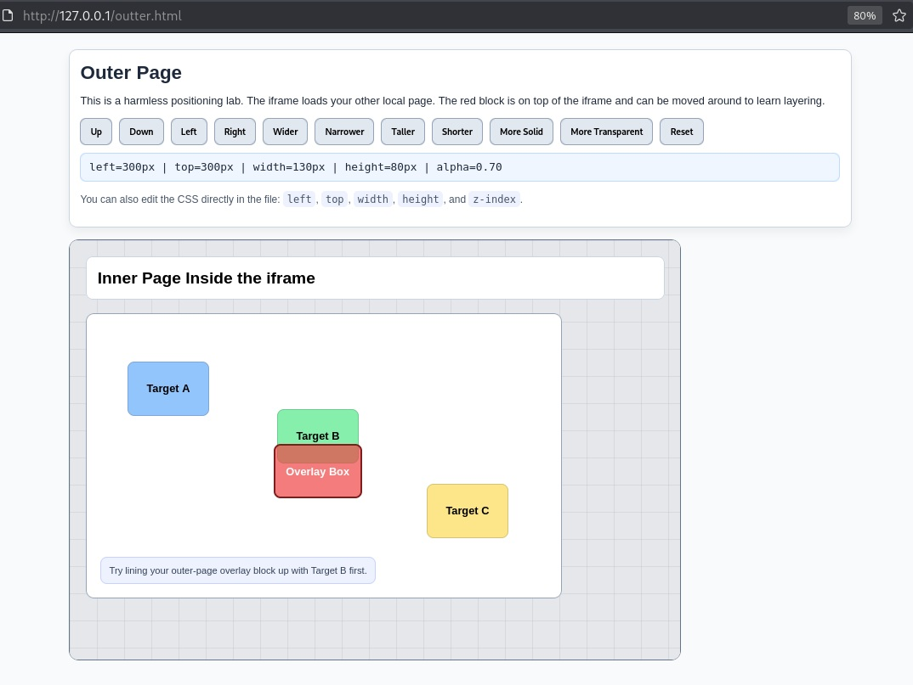

# Web-App-Testing

While taking Tyler Ramsbey's Foundations of Web App Pentesting course, I reached the lesson "Challenge: Clickjacking" and was having a bit of a time trying to figure out the overlay part.  So I asked ChatGPT to help and this is the code that it came up with.

In Kali Linux, start by using the Python module http.server to start a web server on port 80 using the command `python -m http.server 80`.

Next, use the Python module http.server to start a web server on port 8080 using the command `python -m http.server 8080`.

**NOTE:**  These ports can be whatever you prefer, but you will need to modify the outter.html code to point to the secondary http server's IP and Port.

Open your web broswer of choice and visit, http://127.0.0.1/outter.html (or whatever IP and Port you have setup for your server.)

As you move the Overlay Box around to cover the correct target, the CSS positioning and transparency setting appear below the positioning buttons (in this case left=300px, top=300px, width=130px, height=80px, alpha=0.70).
